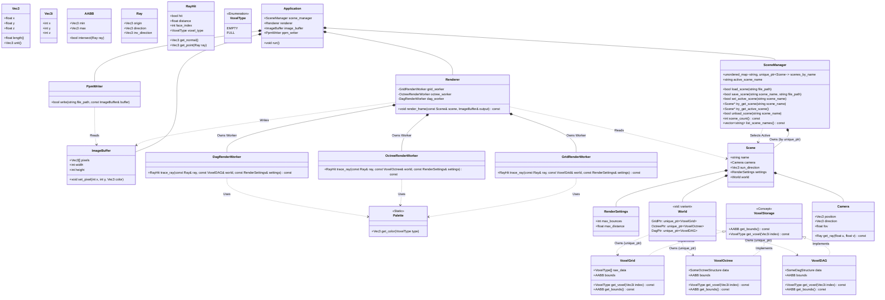

## Voxel Raytracer diagram

```mermaid
classDiagram
    class Vec3 {
        +float x
        +float y
        +float z
        +float length()
        +Vec3 unit()
    }

    class Vec3i {
        +int x
        +int y
        +int z
    }

    class AABB {
        +Vec3 min
        +Vec3 max
        +bool intersect(Ray ray)
    }

    class Ray {
        +Vec3 origin
        +Vec3 direction
        +Vec3 inv_direction
    }

    class RayHit {
        +bool hit
        +float distance
        +int face_index
        +VoxelType voxel_type
        +Vec3 get_normal()
        +Vec3 get_point(Ray ray)
    }

    class ImageBuffer {
        +Vec3[] pixels
        +int width
        +int height
        +void set_pixel(int x, int y, Vec3 color)
    }

    class PpmWriter {
        +bool write(string file_path, const ImageBuffer& buffer)
    }

    class VoxelType {
        <<Enumeration>>
        EMPTY
        FULL
    }

    class Palette {
        <<Static>>
        +Vec3 get_color(VoxelType type)
    }

    class RenderSettings {
        +int max_bounces
        +float max_distance
    }

    class VoxelStorage {
        <<Concept>>
        +AABB get_bounds() const
        +VoxelType get_voxel(Vec3i index) const
    }

    class VoxelGrid {
        +VoxelType[] raw_data
        +AABB bounds
        +VoxelType get_voxel(Vec3i index) const
        +AABB get_bounds() const
    }

    class VoxelOctree {
        +SomeOctreeStructure data
        +AABB bounds
        +VoxelType get_voxel(Vec3i index) const
        +AABB get_bounds() const
    }

    class VoxelDAG {
        +SomeDagStructure data
        +AABB bounds
        +VoxelType get_voxel(Vec3i index) const
        +AABB get_bounds() const
    }

    class World {
        <<std::variant>>
        GridPtr: unique_ptr~VoxelGrid~
        OctreePtr: unique_ptr~VoxelOctree~
        DagPtr: unique_ptr~VoxelDAG~
    }

    class Camera {
        +Vec3 position
        +Vec3 direction
        +float fov
        +Ray get_ray(float u, float v) const
    }

    class Scene {
        +string name
        +Camera camera
        +Vec3 sun_direction
        +RenderSettings settings
        +World world
    }

    class GridRenderWorker {
        +RayHit trace_ray(const Ray& ray, const VoxelGrid& world, const RenderSettings& settings) const
    }

    class OctreeRenderWorker {
        +RayHit trace_ray(const Ray& ray, const VoxelOctree& world, const RenderSettings& settings) const
    }

    class DagRenderWorker {
        +RayHit trace_ray(const Ray& ray, const VoxelDAG& world, const RenderSettings& settings) const
    }

    class Renderer {
        -GridRenderWorker grid_worker
        -OctreeRenderWorker octree_worker
        -DagRenderWorker dag_worker
        +void render_frame(const Scene& scene, ImageBuffer& output) const
    }

    class SceneManager {
        +unordered_map~string, unique_ptr~Scene~~ scenes_by_name
        +string active_scene_name

        +bool load_scene(string file_path)
        +bool save_scene(string scene_name, string file_path)

        +bool set_active_scene(string scene_name)
        +Scene* try_get_scene(string scene_name)
        +Scene* try_get_active_scene()

        +bool unload_scene(string scene_name)
        +int scene_count() const
        +vector~string~ list_scene_names() const
    }

    class Application {
        +SceneManager scene_manager
        +Renderer renderer
        +ImageBuffer image_buffer
        +PpmWriter ppm_writer
        +void run()
    }

    VoxelStorage <|.. VoxelGrid : Implements
    VoxelStorage <|.. VoxelOctree : Implements
    VoxelStorage <|.. VoxelDAG : Implements

    Application *-- SceneManager
    Application *-- Renderer
    Application *-- ImageBuffer
    Application *-- PpmWriter

    SceneManager *-- Scene : Owns (by unique_ptr)
    SceneManager ..> Scene : Selects Active

    Scene *-- Camera
    Scene *-- RenderSettings
    Scene *-- World

    World ..> VoxelGrid : Owns (unique_ptr)
    World ..> VoxelOctree : Owns (unique_ptr)
    World ..> VoxelDAG : Owns (unique_ptr)

    Renderer *-- GridRenderWorker : Owns Worker
    Renderer *-- OctreeRenderWorker : Owns Worker
    Renderer *-- DagRenderWorker : Owns Worker

    Renderer ..> Scene : Reads
    Renderer ..> ImageBuffer : Writes

    PpmWriter ..> ImageBuffer : Reads

    GridRenderWorker ..> Palette : Uses
    OctreeRenderWorker ..> Palette : Uses
    DagRenderWorker ..> Palette : Uses

```
